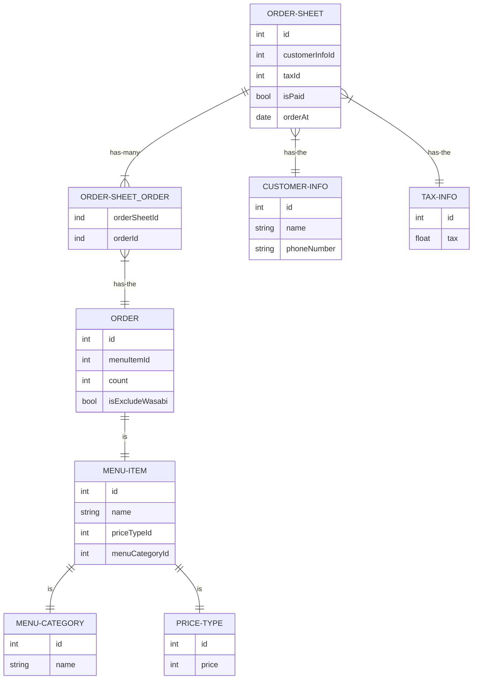
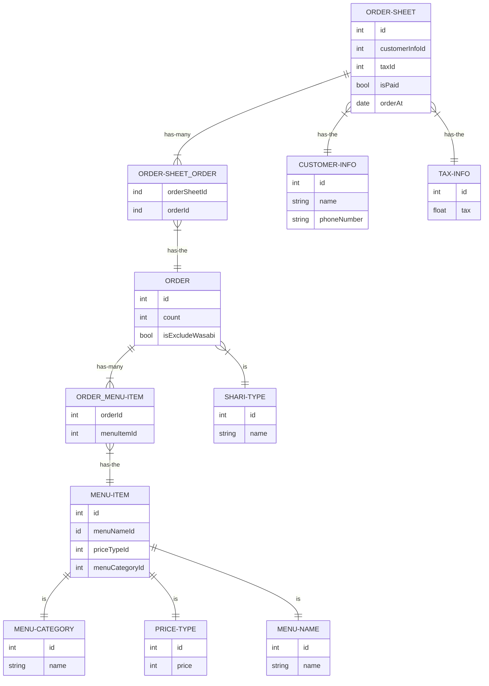

# DB モデリング 1

## 課題 1

### 完成 ER 図

### 仕様要件

https://github.com/praha-inc/praha-challenge-templates/blob/master/db/design/sushi.png

### 物理モデルと論理モデルについて

(後述)

## 課題２

### 完成 ER 図

### 仕様変更要件

- しゃりの大小を選べるようにする
- セットの持つネタを特定できるようにする
- ネタ毎に集計できるようにする

## 課題 3

- 現場では、ワサビ「ぬき」の欄に ✓ マークに加えて、ワサビ抜きの枚数を数字で書く運用がされていました。それに対応して、ワサビを抜く枚数を指定できるようにしてください。
- 某人気店「Plate of silver」に対抗して、セットメニューを入れ替えれるようにしたいとシャッチョーがお達ししました。それに対応して、セットメニューのネタを自由に入れ替えた注文を保存できるようにしてください。(ここでは、セットメニューの金額はセットメニューの持つネタの金額の合計とします。また、入れ替える前のネタと入れ替えた後のネタの履歴を保存しておく必要があります。)
