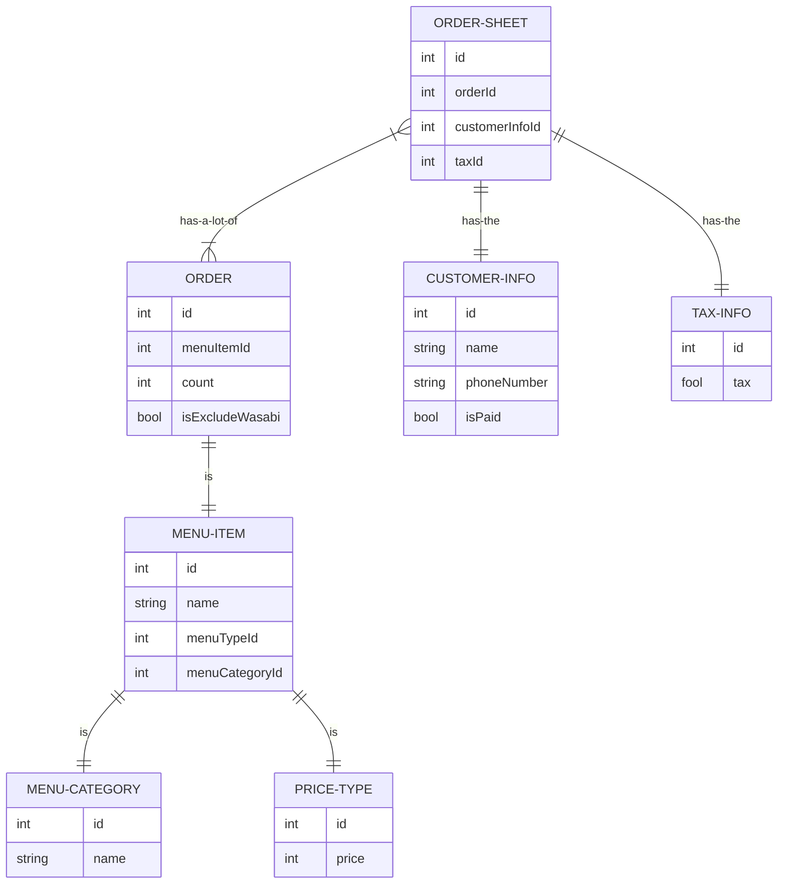

# 課題 1

## DB スキーマ

```mermaid
erDiagram
    ORDER-SHEET }|--|{ ORDER : has-a-lot-of
    ORDER-SHEET ||--|| CUSTOMER-INFO : has-the
    ORDER-SHEET ||--|| TAX-INFO : has-the
    ORDER ||--|| MENU-ITEM : is
    MENU-ITEM ||--|| MENU-CATEGORY : is
    MENU-ITEM ||--|| PRICE-TYPE : is

    ORDER-SHEET {
        int id
        int orderId
        int customerInfoId
        int taxId
    }

    ORDER {
        int id
        int menuItemId
        int count
        bool isExcludeWasabi
    }

    MENU-ITEM {
        int id
        string name
        int menuTypeId
        int menuCategoryId
    }

    PRICE-TYPE {
        int id
        int price
    }

    MENU-CATEGORY {
        int id
        string name
    }

    CUSTOMER-INFO {
        int id
        string name
        string phoneNumber
        bool isPaid
    }

    TAX-INFO {
        int id
        fool tax
    }
```

### 物理モデルと論理モデルについて

## 課題２
