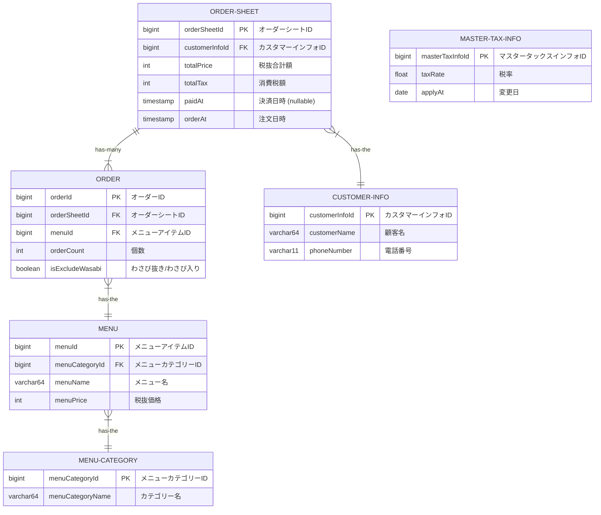
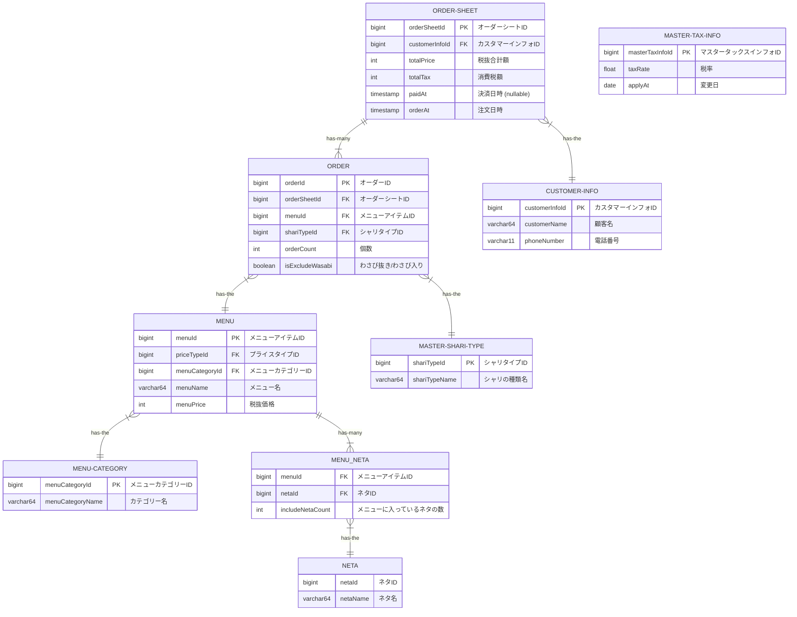

# DB モデリング 1

## 課題 1

### 完成 Relational model 図

### 仕様要件

https://github.com/praha-inc/praha-challenge-templates/blob/master/db/design/sushi.png

### 物理モデルと論理モデルについて

> 論理モデル 概念モデルを基に、詳細に落とし込んだもの。ER 図上だけの情報。
> 物理モデル 論理モデルを基に、さらに詳細に落とし込んだもの。実際のデータベースの情報と１対１の関係になる。
> [ER 図 論理・物理を使い分ける例](https://products.sint.co.jp/ober/blog/logic-physics)

> 論理設計では、概念設計によって作成された概念モデルを、特定のデータモデルに対応した論理モデルに変換します。したがって、リレーショナルデータベースによってデータを管理するのであれば、ER モデルからリレーショナルモデルを作成していきます。
> ER モデルからリレーショナルモデル、つまり、テーブル（リレーション）への変換は機械的に行うことができます。しかし、そのままテーブルに変換しただけでは、リレーショナルモデルとして適切な形式にならない場合があります。
>
> そこで、論理設計ではテーブルをリレーショナルモデルとして適切な形式に変換する作業（正規化）を行います。テーブルを正規化することによってデータの冗長性や不整合の発生を減少させることができます。
> また、論理設計では、ER モデルにおける属性をテーブルの列としてデータ型を決定し、テーブルや列に対して制約を定義するといったことも、この段階において行います。
>
> 物理設計の段階になって初めてデータベースとしての性能について考慮します。具体的には、論理設計において正規化したテーブルの定義を崩したり、インデックスを定義したりして性能が向上するようにモデルを修正していきます。また、物理設計では使用するデータベースに依存する機能を使用することもあります。
> 物理設計によって修正されたモデルを物理モデルと呼び、このモデルをもって実際にデータベースによって管理することができる形式となります。
>
> [データベース設計とは](https://gihyo.jp/dev/feature/01/database/0001)

> [Difference between ER Model and Relational Model](https://www.javatpoint.com/er-model-vs-relational-model)

つまるところ

- 論理モデル
  - MySQL, Prostgre SQL 等の RDB のみを想定してモデリングする。
  - RDB のテーブル設計を行う。
  - 正規化を行う。
- 物理モデル
  - RDB に加えてそれを利用する Symfony, RoR, NestJS などのサーバーアプリケーションを想定してモデリングする。

#### (3 層スキーマアーキテクチャ)

- 外部スキーマ (アプリケーション)
- 概念スキーマ (ER モデル)
- 内部スキーマ (Relational モデル)
  - 論理モデル
  - 物理モデル

## 課題２

### 完成 Relational model 図

### 仕様変更要件

- しゃりの大小を選べるようにする
- セットの持つネタを特定できるようにする
- ネタ毎に集計できるようにする

## 課題 3

- 現場では、ワサビ「ぬき」の欄に ✓ マークに加えて、ワサビ抜きの枚数を数字で書く運用がされていました。それに対応して、ワサビを抜く枚数を指定できるようにしてください。
- 某人気店「Plate of silver」に対抗して、セットメニューを入れ替えれるようにしたいとシャッチョーがお達ししました。それに対応して、セットメニューのネタを自由に入れ替えた注文を保存できるようにしてください。(ここでは、セットメニューの金額はセットメニューの持つネタの金額の合計とします。また、入れ替える前のネタと入れ替えた後のネタの履歴を保存しておく必要があります。)
