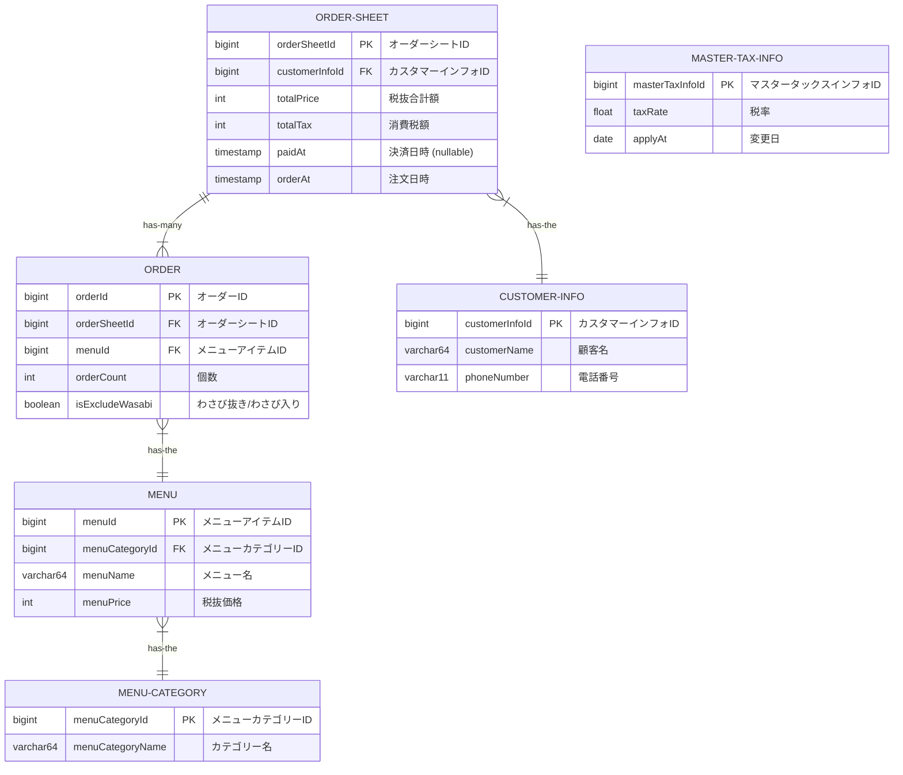
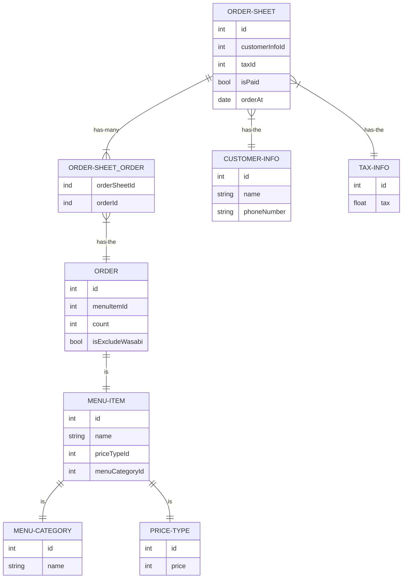

## Version 2

物理モデル

```mermaid
erDiagram
    ORDER-SHEET ||--|{ ORDER : has-many
    ORDER-SHEET }|--|| CUSTOMER-INFO : has-the
    ORDER }|--|| MENU : has-the
    MENU }|--|| MENU-CATEGORY : has-the

    ORDER-SHEET {
        bigint orderSheetId PK "オーダーシートID"
        bigint customerInfoId FK "カスタマーインフォID"
        int totalPrice "税抜合計額"
        int totalTax "消費税額"
        timestamp paidAt "決済日時 (nullable)"
        timestamp orderAt "注文日時"
    }

    ORDER {
        bigint orderId PK "オーダーID"
        bigint orderSheetId FK "オーダーシートID"
        bigint menuId FK "メニューアイテムID"
        int orderCount "個数"
        boolean isExcludeWasabi "わさび抜き/わさび入り"
    }

    MENU {
        bigint menuId PK "メニューアイテムID"
        bigint menuCategoryId FK "メニューカテゴリーID"
        varchar64 menuName "メニュー名"
        int menuPrice "税抜価格"
    }

    MENU-CATEGORY {
        bigint menuCategoryId PK "メニューカテゴリーID"
        varchar64 menuCategoryName "カテゴリー名"
    }

    CUSTOMER-INFO {
        bigint customerInfoId PK "カスタマーインフォID"
        varchar64 customerName "顧客名"
        varchar11 phoneNumber "電話番号"
    }

    MASTER-TAX-INFO {
        bigint masterTaxInfoId PK "マスタータックスインフォID"
        float taxRate "税率"
        date applyAt "変更日"
    }
```

## Version 1

```mermaid
erDiagram
    ORDER-SHEET ||--|{ ORDER-SHEET_ORDER : has-many
    ORDER-SHEET_ORDER }|--|| ORDER : has-the
    ORDER-SHEET }|--|| CUSTOMER-INFO : has-the
    ORDER-SHEET }|--|| TAX-INFO : has-the
    ORDER ||--|| MENU-ITEM : is
    MENU-ITEM ||--|| MENU-CATEGORY : is
    MENU-ITEM ||--|| PRICE-TYPE : is

    ORDER-SHEET {
        int id
        int customerInfoId
        int taxId
        bool isPaid
        date orderAt
    }

    ORDER-SHEET_ORDER {
        ind orderSheetId
        ind orderId
    }

    ORDER {
        int id
        int menuItemId
        int count
        bool isExcludeWasabi
    }

    MENU-ITEM {
        int id
        string name
        int priceTypeId
        int menuCategoryId
    }

    PRICE-TYPE {
        int id
        int price
    }

    MENU-CATEGORY {
        int id
        string name
    }

    CUSTOMER-INFO {
        int id
        string name
        string phoneNumber
    }

    TAX-INFO {
        int id
        float tax
    }
```
