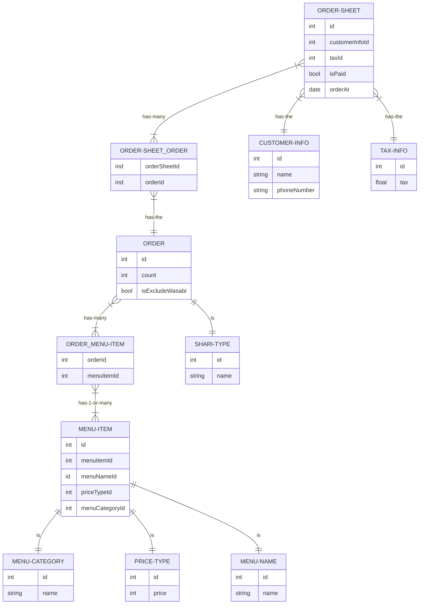

```mermaid
erDiagram
    ORDER-SHEET }|--|{ ORDER-SHEET_ORDER : has-many
    ORDER-SHEET }|--|| CUSTOMER-INFO : has-the
    ORDER-SHEET }|--|| TAX-INFO : has-the
    ORDER-SHEET_ORDER }|--|| ORDER : has-the
    ORDER }|--|{ ORDER_MENU-ITEM : has-many
    ORDER ||--|| SHARI-TYPE : is
    ORDER_MENU-ITEM }|--|{ MENU-ITEM : has-1-or-many
    MENU-ITEM ||--|| MENU-CATEGORY : is
    MENU-ITEM ||--|| PRICE-TYPE : is
    MENU-ITEM ||--|| MENU-NAME: is

    ORDER-SHEET {
        int id
        int customerInfoId
        int taxId
        bool isPaid
        date orderAt
    }

    ORDER-SHEET_ORDER {
        ind orderSheetId
        ind orderId
    }

    ORDER {
        int id
        int count
        bool isExcludeWasabi
    }

    ORDER_MENU-ITEM {
        int orderId
        int menuItemId
    }

    MENU-ITEM {
        int id
        int menuItemId
        id menuNameId
        int priceTypeId
        int menuCategoryId
    }

    MENU-NAME {
        int id
        string name
    }

    SHARI-TYPE {
        int id
        string name
    }

    PRICE-TYPE {
        int id
        int price
    }

    MENU-CATEGORY {
        int id
        string name
    }

    CUSTOMER-INFO {
        int id
        string name
        string phoneNumber
    }

    TAX-INFO {
        int id
        float tax
    }
```
