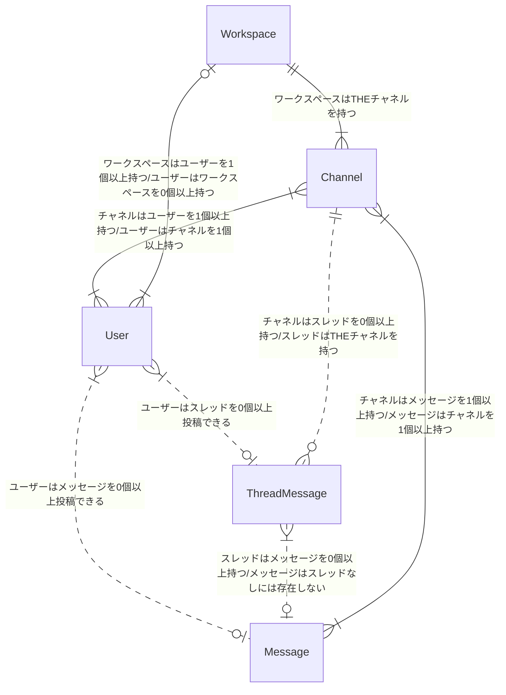
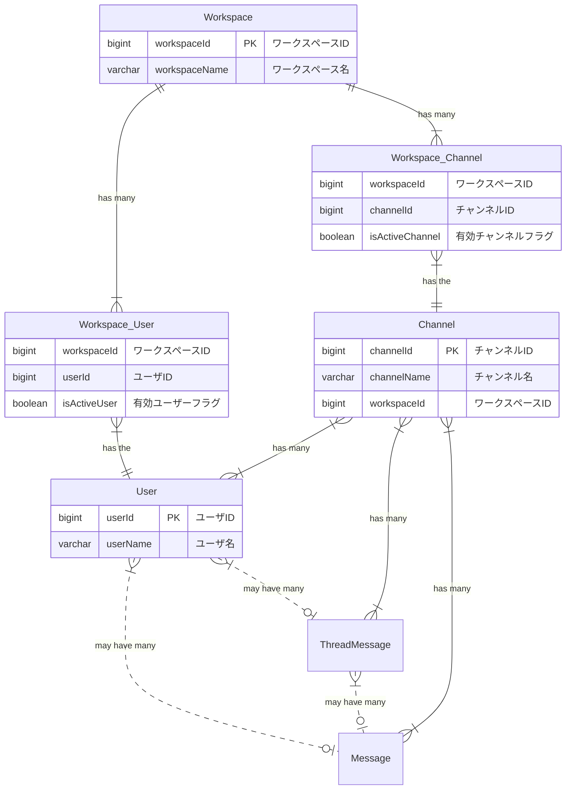

# DB モデリング 2

## 課題 1

### 論理モデル

### 物理モデル

### 仕様

- メッセージ

  - 誰が、どのチャネルに、いつ、どんな内容を投稿したのか分かること

- スレッドメッセージ

  - 誰が、どのメッセージに、いつ、どんな内容をスレッドとして投稿したのか分かること

- チャネル

  - そのチャネルに所属しているユーザにしか、メッセージ・スレッドメッセージが見えないこと

- ユーザ

  - ワークスペースに参加・脱退できること
  - チャネルに参加・脱退できること

- 横断機能
  - メッセージとスレッドメッセージを横断的に検索できること（例えば「hoge」と検索したら、この文字列を含むメッセージとスレッドメッセージを両方とも取得できること）
  - 参加していないチャネルのメッセージ・スレッドメッセージは検索できないこと
