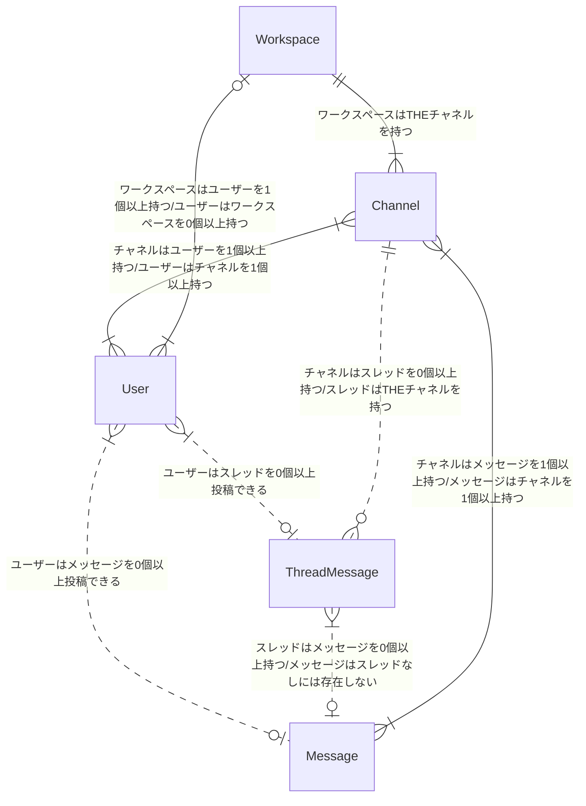
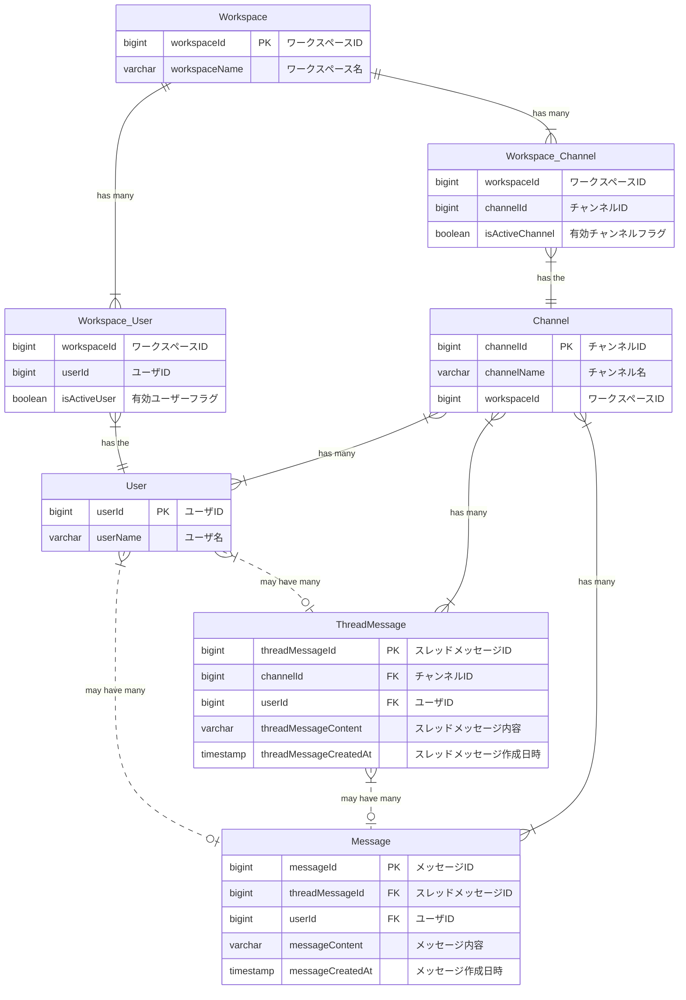

# DB モデリング 2

## 課題 1

### 物理モデル

[https://dbdiagram.io/d/63084a02f1a9b01b0fe8767d](https://dbdiagram.io/d/63084a02f1a9b01b0fe8767d)

### 論理モデル

### 仕様

自分で付け足した仕様は `(add.)` で記載します。

- メッセージ

  - 誰が、どのチャネルに、いつ、どんな内容を投稿したのか分かること
  - (add.) メッセージの形式はテキストのみ
  - (add.) メッセージを投稿した日時を記録している
  - (add.) メッセージはスレッドメッセージがないと存在しない。

- スレッドメッセージ

  - 誰が、どのメッセージに、いつ、どんな内容をスレッドとして投稿したのか分かること
  - (add.) スレッドメッセージはメッセージを 0 個以上持つ
  - (add.) スレッドメッセージとスレッドの違いは子を持てるかどうか
  - (add.) スレッドメッセージのみを簡単に取得できる
  - (add.) スレッドメッセージはチャネルに紐付いている

- チャネル

  - そのチャネルに所属しているユーザにしか、メッセージ・スレッドメッセージが見えないこと

- ユーザ

  - (add.) ユーザーはユーザー名を設定できる
  - (add.) ユーザーはユーザー名を変更できる
  - ワークスペースに参加・脱退できること
  - チャネルに参加・脱退できること

- ワークスペース

  - (add.) ワークスペースは名前を設定できる
  - (add.) ワークスペースの名前は更新できる
  - (add.) ワークスペースは過去に参加したユーザーの情報を持っている。

- 横断機能
  - メッセージとスレッドメッセージを横断的に検索できること（例えば「hoge」と検索したら、この文字列を含むメッセージとスレッドメッセージを両方とも取得できること）
  - 参加していないチャネルのメッセージ・スレッドメッセージは検索できないこと

### 検討事項

- スレッドメッセージとメッセージは上手くやれば１つにまとめることができる
  - 自己参照にするとリレーションシップが複雑になりそうなので、別テーブルにする
