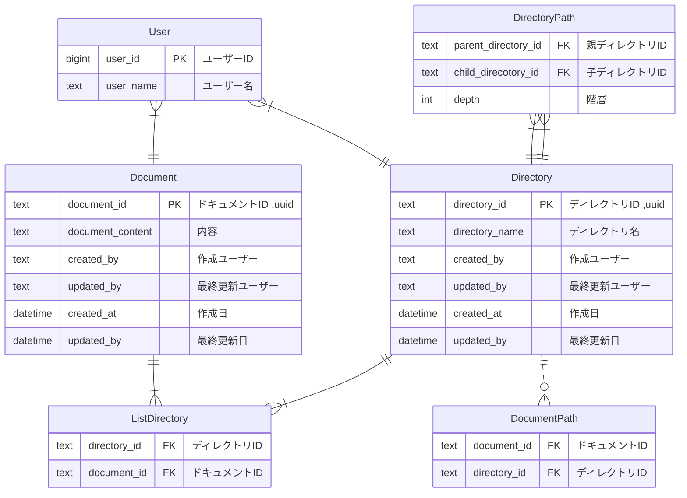

# 課題１

### ER 図

### 仕様要件

- ドキュメント
  - いつ、誰が、どんなテキスト情報を保存したのか管理する
  - ドキュメントは必ず何らかのディレクトリに属する
- ディレクトリ
  - 一つ以上のドキュメントを含む階層構造
  - ディレクトリは無制限にサブディレクトリを持つことができる
  - ディレクトリ構造は柔軟に変更可能。ディレクトリが移動してサブディレクトリになることもあり得る
- ユーザ
  - ドキュメントを CRUD（作成、参照、更新、削除）できる
  - ディレクトリを CRUD できる
