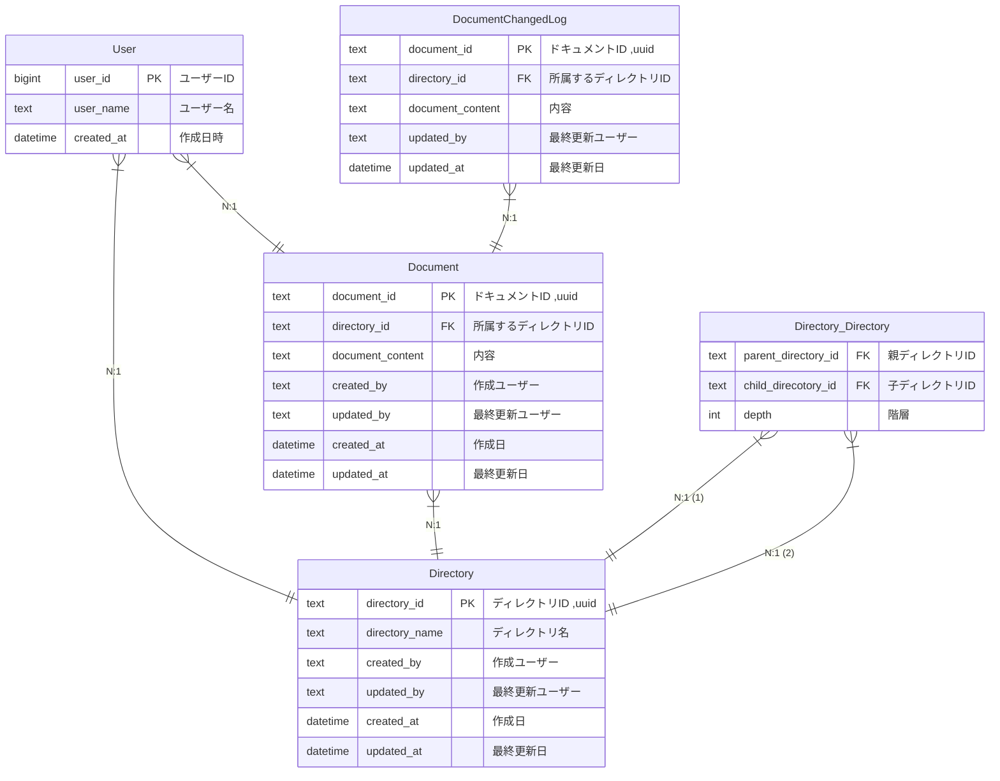
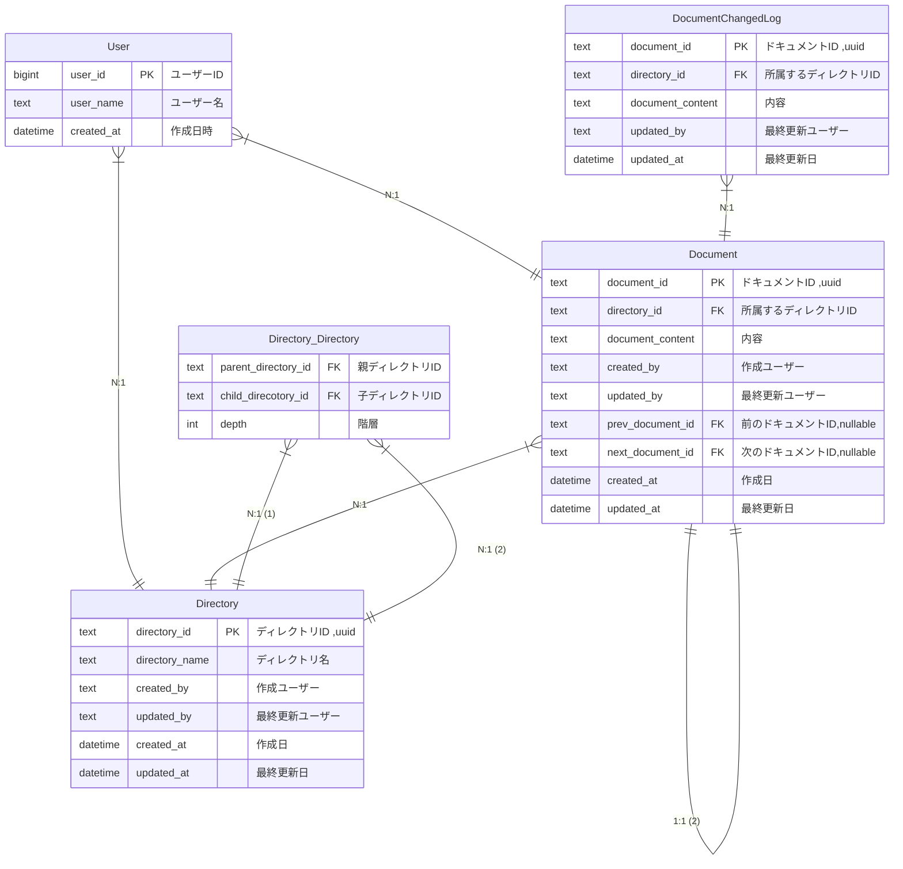

# 課題１

### ER 図

### 仕様要件

- ドキュメント
  - いつ、誰が、どんなテキスト情報を保存したのか管理する
    - (add.) 履歴を取得することができる
    - (add.) 変更した差分を取得することができる
  - ドキュメントは必ず何らかのディレクトリに属する
- ディレクトリ
  - 一つ以上のドキュメントを含む階層構造
  - ディレクトリは無制限にサブディレクトリを持つことができる
  - ディレクトリ構造は柔軟に変更可能。ディレクトリが移動してサブディレクトリになることもあり得る
    - (add.) ディレクトリは 0 個以上のドキュメントまたはディレクトリを持つ
- ユーザ
  - ドキュメントを CRUD（作成、参照、更新、削除）できる
  - ディレクトリを CRUD できる
    - (add.) ディレクトリが Delete された場合、そのディレクトリに属する全てのドキュメントとディレクトリが削除される

# 課題 2

### 仕様要件

- ディレクトリ内のドキュメントの順番を変更できる
  - (add.) ドキュメントの順番を保持する
- 順番はユーザー間で共有される

### food for thought

- Todoist はおそらく `child_order` を親に持たせてる。

