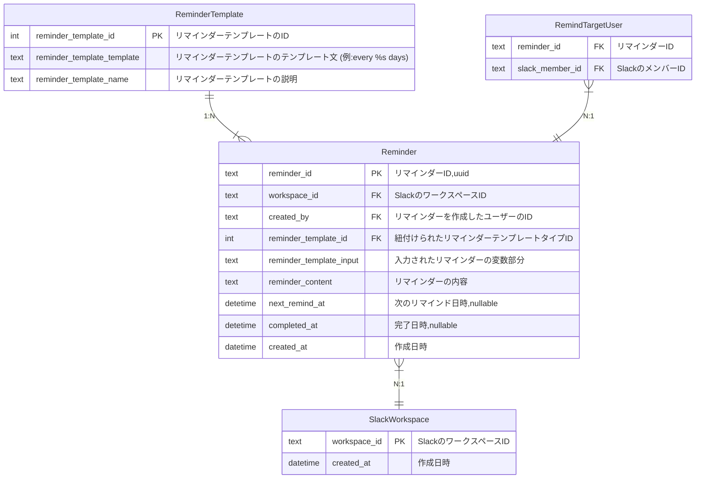

# 課題１

### 仕様要件

- Slack に登録している他のユーザ（複数可）宛にリマインダーを設定できる
- リマインダーには送信相手、文面、頻度を指定可能
- 1 時間ごとにバッチが動き、配信が必要なリマインダーを指定された Slack ユーザに配信する
- リマインダーの周期は 4 種類で種類を増やす可能性がある
  - 毎日
  - X 日おき
  - 毎週 X 曜日
  - 毎月 X 日
- (add.) 1 ユーザーの保有するリマインドを一覧で取得できる
- (add.) 1 ユーザーが設定したリマインドを一覧で取得できる
- (add.) リマインドが完了に応じてリマインドを設定したユーザーに通知することができる

https://penpen.netlify.app/
https://qiita.com/dowanna6/items/b5d1d0245985a26abf8e

### ER 図



### アプリケーションサイドのフロー

#### サーバーによるリマインドの実行

1. 1 時間おきにリマインドを実行するバッチを実行する
2. バッチは`Reminder`から`next_remind_at`が現在時刻より前のものかつ`completed_at`が`null`でないものを取得する
   1. `RemindTargetUser` から `reminder_id` が一致する リマインドを送るユーザーの一覧を取得する。
3. 取得した一覧に対してリマインドを送る
4. 送信したリマインダーの`next_remind_at`を更新する

2 の SQL はこのようになる

```sql
SELECT reminder_id, workspace_id, RemindTargetUser.user_id, reminder_term_type_id, reminder_term, reminder_content, next_remind_at, completed_at, created_at
FROM reminder
WHERE next_remind_at < now() AND completed_at IS NULL
JOIN remind_target_user ON remind_target_user.reminder_id = reminder.reminder_id;
```

#### ユーザーによるリマインダーの作成

1. `ReminderTermType` からリマインダーの周期を決めるテンプレートを取得してアプリケーションにキャッシュする。
2. ユーザーがリマインダーを作成するコマンドを実行する。
3. コマンドをスペース区切りで分けて解析する。
   1. 特にリマインダーの周期を`ReminderTermType.reminder_term_type_template` に一致するものを取得する。
4. `Reminder`に新しいレコードを作成する。

#### ユーザーによるリマインダーの完了

1. ユーザーがリマインダーを完了するコマンドを実行する。
2. `Reminder`から`reminder_id`が一致するレコードを取得する。
3. `completed_at`を現在時刻に更新する。

`next_remind_at` を `NULL` に更新せずにしておくと、「やり直し」ができるようになる。

#### サーバーによるリマインダーの完了通知

1. 「ユーザーによるリマインダーの完了」をトリガーにしてリマインダーを完了したユーザーに通知する。

#### ユーザーによる自己に設定されたリマインダーの一覧取得

1. `RemindTargetUser` と `Reminder` を結合して、`RemindTargetUser.user_id` が一致するものを取得する。
   1. `Reminder.completed_at` が `NULL` でないものは除外する。

#### ユーザーによる自己の設定したリマインダーの一覧取得

1. `Reminder` の `created_by` がユーザーの ID であるものを取得する。

#### ワークスペースに slack アプリを追加する

1. `SlackWorkspace` に `workspace_id` を追加する

### その他検討事項

#### `SlackUser` は slack api を通じていちいち取得してきてよいのでは?

- slack api を繰り返し叩くのは負荷が高いので、`SlackUser` は定期的に取得してきて DB に保存しておく。という方針にした。
- SlackUser を DB に保存する必要は必要ないため削っても良い。

- SlackUser を DB に保存しない方が`SlackUser`が古くなることについて考慮する必要がない。
- `RemindTargetUser.slack_user_id` と `RemindTargetUser.created_by` で Slack のユーザ ID を使用している。
- しかし、取得する度に slack api を叩くのはやはりレートリミットに引っかかってしまいそう。
- また、レスポンスタイムも遅くなる?。要調査。
- 2020/09/10 slack api の調査をして保存しておく必要なさそうなので削る。
  - Slack ユーザーのメンバー ID さえ`Reminder`に保存しておけば事足りる。

#### `RemindTargetUser` を正規化する必要はあるのか?このアプリケーション専用の DB なら配列で持ってもいいのでは?

- 「ユーザーによる自己に設定されたリマインダーの一覧取得」のユースケースからは正規化した方が良い。配列として持つとフィルターして取得できない。(文字列として保存すれば、前方一致で絞り込めるなら取得できる。)
- アプリケーションの開発のコストとトレードオフ。やはり正規化した方が良い。
